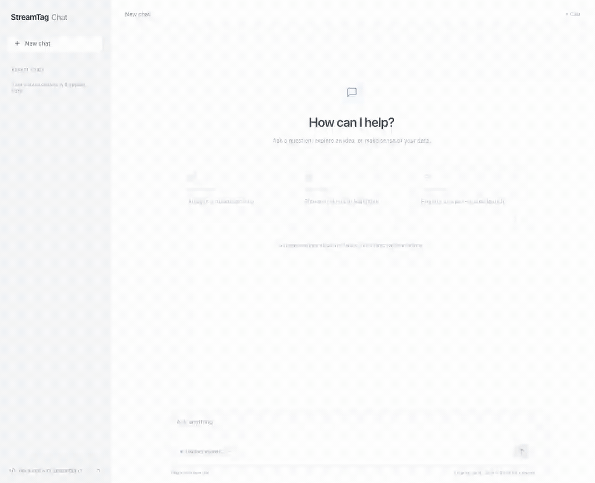
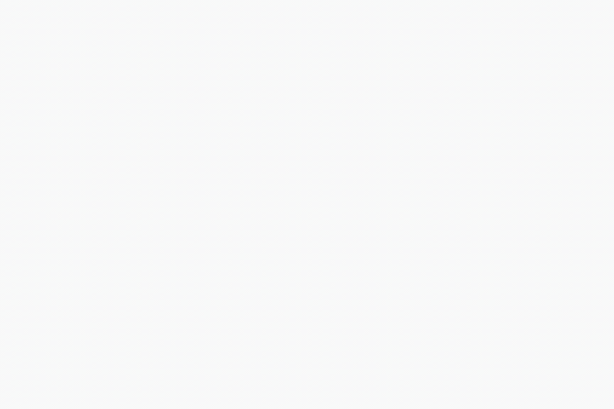
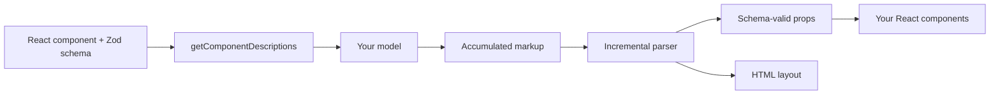
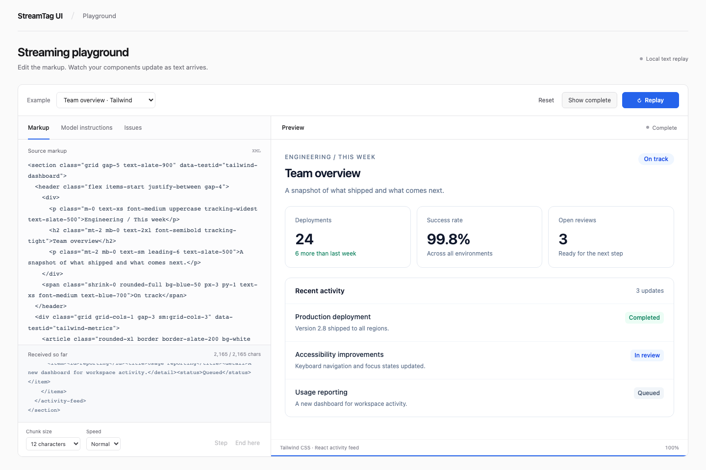

# StreamTag UI

[](LICENSE)
[](https://www.typescriptlang.org/)
[](https://react.dev/)
[](https://zod.dev/)

[Playground](#try-the-playground) · [Inline chat](#try-inline-chat) · [How It Works](#how-it-works) · [Tailwind example](#tailwind-css) · [API](#the-three-apis) · [Contributing](CONTRIBUTING.md)

**Let AI compose HTML and your React components, then render them as the text arrives.**

StreamTag UI is a small React library for generative interfaces. It combines ordinary HTML layouts with trusted, schema-defined React components. Text can grow while it streams; charts can receive complete data points before the entire chart has arrived.

[](docs/media/inline-chat.mp4)

**Ask a question. Watch the reply become an interactive interface. Keep chatting.** This recording shows a real model response with fictional business data: chart points and table rows arrive inside the message, a legend toggle works, and a follow-up uses the conversation context. No separate result page.

[Watch the 17-second recording](docs/media/inline-chat.mp4) · [Run this example](examples/chat/README.md) · [How it was recorded](docs/media/README.md#inline-chat-live-model)

- **Three APIs:** `defineComponent`, `getComponentDescriptions`, and `StreamRenderer`.
- **Your components:** use an existing chart, table, card, or product component.
- **Your CSS:** ordinary stylesheets, utility classes, and inline styles work within the supported HTML subset. CSS is supplied by the host application.
- **Your model and transport:** pass accumulated text from any source.
- **One package:** TypeScript types, a browser renderer, and a React-free server description entry point.

Version 0.1 uses its own XML-style markup format, not the A2UI JSON protocol.

## Install

```sh
npm install streamtag-ui zod
```

Use React 18.2 or 19 in your application. See the [API example](#the-three-apis) below and the [changelog](packages/streamtag-ui/CHANGELOG.md).

## See it stream



A recording of the actual playground with fictional data. Watch the second line appear while the chart instance stays mounted. [Watch the full recording](docs/media/streaming-demo.mp4) or [reproduce the recording](docs/media/README.md).

## Try the playground

Requirements: Node.js 22.12 or newer and pnpm 10.30.3. The repository pins its pnpm version through `packageManager`.

```sh
git clone https://github.com/xiaoosi/streamtag-ui.git
cd streamtag-ui
pnpm install
pnpm dev
```

Open the local URL printed by Vite. Press **Play stream** to replay a fictional report with an ECharts line chart and a React table. No API key, remote font, or model account is needed. Use one-character chunks to inspect partial numbers, pause or step the stream, edit the markup, and inspect generated model instructions or errors.

The playground is a deterministic replay tool. It does not connect to a model service or manage API keys.

## Try inline chat

The [chat starter](examples/chat/README.md) connects to a real model and renders every assistant reply directly in the conversation. Text, growing chart series, tables, and interactive checklists can appear in the same message. Continue the conversation to ask follow-up questions.

```sh
cp examples/chat/.env.example examples/chat/.env
# Set MODEL_BASE_URL, MODEL_API_KEY, and MODEL_NAME in that file.
pnpm dev:chat
```

Open **http://127.0.0.1:5174**. The starter uses the published npm package and a server-side OpenAI-compatible Chat Completions adapter. You can copy `examples/chat` into an independent project. See its [setup, component guide, and interaction boundaries](examples/chat/README.md).

## How It Works

Your application owns the model, transport, and CSS. StreamTag turns the growing text into ordinary HTML and registered React components.



1. **Define and describe.** `defineComponent` pairs a trusted React component with its Zod props schema. `getComponentDescriptions` turns that catalog into markup instructions and JSON Schemas for your model.
2. **Parse only new text.** Pass the full response received so far to `StreamRenderer`. Its parser consumes the appended suffix and keeps stable node identities. No generated JavaScript is evaluated.
3. **Publish valid values.** Text can grow while its tag is open. Numbers, booleans, enums, and literals wait for a closing tag. Objects and array entries become available when their current values satisfy the schema.
4. **Update the existing UI.** Changed props flow into the mounted component. A series can start with an empty array, gain complete points, and be joined by a second series before the entire chart closes.

For example, `<item>12` contributes no numeric point yet. After `0</item>` arrives, the chart receives `120` once. It never receives the intermediate values `1` or `12`. See [streaming semantics](docs/streaming.md) for nested objects, fallbacks, and errors.

## The three APIs

```tsx
import { z } from 'zod';
import {
  defineComponent,
  getComponentDescriptions,
  StreamRenderer,
} from 'streamtag-ui';

const scoreCard = defineComponent({
  name: 'score-card',
  description: 'Display a title and numeric score.',
  schema: z.object({ title: z.string(), score: z.number() }),
  component: ({ title, score }) => (
    <article className="score-card">
      <h2>{title}</h2>
      <strong>{score}</strong>
    </article>
  ),
  fallback: <p>Waiting for the score…</p>,
});

// Keep definitions outside the render function so component identity stays stable.
const components = [scoreCard];
const instructions = getComponentDescriptions(components);

export function Report({
  text,
  generating,
}: {
  text: string;
  generating: boolean;
}) {
  return (
    <StreamRenderer
      components={components}
      content={text}
      streaming={generating}
      onError={(issue) => console.error(issue.code, issue.message)}
    />
  );
}
```

Include `instructions` in the system prompt of your own model integration. Pass the accumulated output into `content` and set `streaming={false}` when generation finishes. The generated markup looks like this:

```xml
<section class="report">
  <h1>A small win</h1>
  <score-card>
    <title>Weekly score</title>
    <score>120.5</score>
  </score-card>
</section>
```

A static saved result uses the same renderer with `streaming` omitted. The default is `false`.

## Streaming behavior

The library only passes schema-valid props to your component. Before required props are available, it renders `fallback` (or nothing).

| Value                          | Publication rule                                              |
| ------------------------------ | ------------------------------------------------------------- |
| String                         | Grows while its tag is open, provided it passes its schema    |
| Number, boolean, enum, literal | Published after the field closes                              |
| Object                         | Published once its current fields satisfy the schema          |
| Array                          | Contains entries whose current values satisfy the item schema |
| Invalid closed field           | Reports an error and shows the component fallback             |

Nested object entries may appear before their closing tag once they are valid. This is what allows a series with a name and a default empty data array to render, then receive points incrementally. A table row with required numeric columns appears once those columns close. This version does not offer a separate "wait for the entire object to close" policy.

For a streaming chart, use defaults for arrays that can legitimately start empty:

```ts
const schema = z.object({
  title: z.string(),
  series: z
    .array(
      z.object({
        name: z.string(),
        data: z.array(z.number()).default([]),
      }),
    )
    .default([]),
});
```

Arrays with `.min(...)` and strings with minimum lengths wait until their constraints are satisfied. No partial numeric prefix is interpreted as a completed number.

## Tailwind CSS

Select **Team overview · Tailwind** in the playground, or run the standalone example:

```sh
pnpm --filter streamtag-ui build
pnpm --filter @streamtag-ui/tailwind-react dev
```



The XML supplies layout classes; the registered React component uses Tailwind for its own internals. Both use the host's compiled stylesheet. The renderer has no Tailwind dependency.

```xml
<section class="grid gap-5 text-slate-900">
  <h2 class="text-2xl font-semibold">Team overview</h2>
  <activity-feed>
    <title>Recent activity</title>
    <items>
      <item><id>deploy</id><title>Production deployment</title><detail>Shipped to all regions.</detail><status>Completed</status></item>
    </items>
  </activity-feed>
</section>
```

Tailwind must compile the classes before model output arrives. This example scans the XML fixture and component source with `@source`. For a live integration, give the model a known class vocabulary and include those classes in source files or `@source inline(...)`. Arbitrary runtime class names do not automatically generate CSS. See the [example and setup](examples/tailwind-react/README.md).

## Server-side model instructions

Use the `streamtag-ui/server` entry point and a shared metadata-only catalog to avoid importing React or browser-only chart code into your model-calling server:

```ts
import { z } from 'zod';
import { getComponentDescriptions } from 'streamtag-ui/server';

export const scoreDefinition = {
  name: 'score-card',
  description: 'Display a title and numeric score.',
  schema: z.object({ title: z.string(), score: z.number() }),
};

const systemPrompt = getComponentDescriptions([scoreDefinition]);
```

On the client, call `defineComponent({ ...scoreDefinition, component: ScoreCard })`. Both entry points belong to the same npm package.

## Scope and boundaries

- Supports React 18.2/19 and Zod 4. Build output is ESM with TypeScript declarations.
- Supported schemas: objects, arrays, strings, finite numbers, booleans, enums, scalar literals, optional fields, and defaults. See [syntax](docs/syntax.md) for exact boundaries.
- HTML uses a documented allowlist. Script, iframe, style, event-handler, and executable URL output are not supported. Model output is data, not executable component code.
- The renderer is **not a browser security sandbox**. Trusted registered components control their own behavior. Styles can affect layout, and supported image/link URLs can reference external resources. Use appropriate host isolation when handling untrusted sources.
- CSS classes must exist in the host. Tailwind runtime generation and CSS Modules class-name mapping are application concerns.
- No model SDK, chat state, transport, arbitrary code execution, A2UI compatibility, or built-in chart library is included.
- Appended text is parsed incrementally. Replaced or shortened content starts a new document. To explicitly start a new stream whose text happens to share the previous prefix, change the renderer's React `key`.

## Repository

```text
packages/streamtag-ui/   Published library; parser, runtime, and renderer are internal modules
apps/playground/        Replay playground and real ECharts/React examples
examples/minimal-react/ Small public-API-only consumer
examples/tailwind-react/ Tailwind CSS 4 layout and streaming React component
examples/chat/          Real-model inline chat starter using the npm package
fixtures/               Markup shared by demonstrations and regression tests
docs/                   Syntax, behavior, integration, and architecture
```

## Development

```sh
pnpm check                    # Formatting, builds, type checks, and unit tests
pnpm exec playwright install chromium
pnpm test:browser             # Chromium integration and responsive layout tests
pnpm --filter @streamtag-ui/minimal-react dev
pnpm --filter @streamtag-ui/tailwind-react dev
pnpm dev:chat                 # Real model; configure examples/chat/.env first
```

See [CONTRIBUTING.md](CONTRIBUTING.md), [quick start](docs/quick-start.md), [streaming](docs/streaming.md), and [architecture](docs/architecture.md).

## License

MIT. See [LICENSE](LICENSE).
